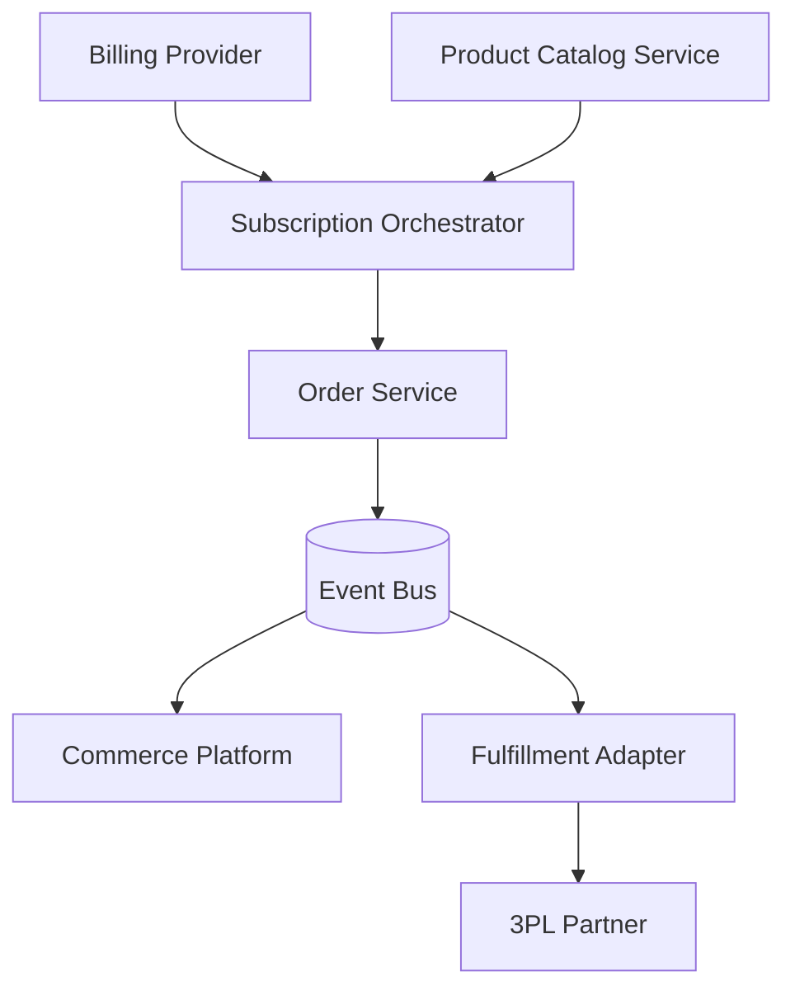

# Systems Thinking & Architecture Exercise  
**Candidate Response**

---

## 1. Decision Framework  
Describe how you would evaluate whether the current e-commerce platform should remain in the architecture.  
Include 1–2 tools, platforms, or techniques you would use to support this evaluation.

### How I Would Evaluate the Current E‑commerce Platform

I would start by separating **symptoms** from **root causes**, and evaluating the platform across four lenses:

**Engineering**
- Degree of coupling between subscription logic, order creation, and fulfillment
- Reliability characteristics (idempotency, retries, failure modes)
- Observability gaps across billing → commerce → 3PL
- Ability to evolve domain logic without brittle workarounds

**Operations**
- Frequency and impact of order inconsistencies
- Manual reconciliation required by Ops / CS
- Blast radius of failures and time‑to‑detect

**Product**
- Misalignment between platform product / variant model and business rules
- Speed of launching new subscription features
- Clarity of source‑of‑truth for product data

**Long‑term Scalability**
- Whether the platform constrains future subscription models
- Cost of continued customization vs platform leverage

### Tools / Techniques

- **Architecture Decision Records (ADR)** to document options, assumptions, and tradeoffs
- **Weighted Decision Matrix** to score options against shared criteria (time‑to‑value, risk, flexibility, team fit)
- **Domain Decomposition (DDD)** to identify clean seams for isolation or replacement

---

## 2. Options Analysis  
Discuss the strengths and limitations of each option:

1. Keep the current platform  
2. Replace it with another platform  
3. Build an internal service  

Include 1–2 tools or platforms you might consider for each option.

| Dimension | **Option A — Keep platform, isolate / refactor** | **Option B — Replace platform** | **Option C — Build internal services** |
|---|---|---|---|
| **Description** | Treat commerce platform as execution layer; move orchestration and rules outside | Move to commerce / subscription-focused platform, keep billing provider | Internal product, checkout, and order services; billing for payments only |
| **Complexity** | Medium | High during migration | Highest upfront |
| **Product Catalog Modeling** | Still constrained, mitigated via internal abstraction | Better alignment with subscriptions | Full alignment with business rules |
| **Subscription → Order Flow** | Improved via idempotency and orchestration | Cleaner lifecycle, fewer hacks | Strong consistency and visibility |
| **Fulfillment / 3PL** | More stable, platform limits remain | More consistent order contracts | Clear contracts and routing logic |
| **Cross-Team Collaboration** | Incremental improvement | Requires tight coordination | Requires sustained alignment |
| **Maintenance Over Time** | Ongoing workaround cost | Lower custom code, higher vendor lock-in | High ownership, high flexibility |
| **Example Tools / Platforms** | Feature flags, API gateway, event bus | Headless commerce, subscription engines | Event-driven services, workflow engines |

---

## 3. Recommended Approach  
Provide your recommendation and explain why.  
Include 1–2 tools or technologies that would support this direction.

**Recommendation**: *Incrementally isolate and replace critical responsibilities (product modeling, subscription orchestration, order creation) while keeping the existing commerce platform as a downstream execution layer.*

**Why this path**
- Avoids the risk of a big‑bang rebuild
- Delivers immediate reliability and debuggability improvements
- Preserves optionality to replace the platform later
- Fits realistic team capacity and delivery timelines

### Observability as a First‑Class Concern
To directly address cross‑system debugging challenges, observability would be designed in from the start:
- End‑to‑end request and event tracing across billing → subscription → order → fulfillment
- Correlation IDs propagated through APIs and events
- Clear ownership of metrics, logs, and alerts per bounded context

**Supporting Tools / Technologies**
- Workflow orchestration (e.g., durable workflows for retries and state transitions)
- Event streaming for order and fulfillment state
- Distributed tracing, structured logs, and domain‑level metrics

---

## 4. High-Level Architecture (Optional)  
Describe what the future architecture *might* look like.  
Optionally include 1–2 tools or technologies you would consider.

**Key Principles**
- Internal services become the source of truth for products and orders
- Commerce platform becomes a channel, not the system of record
- Events, not fragile webhooks, drive state transitions

**Supporting Tools / Technologies**
- Event bus / message queue
- Workflow / orchestration engine
- Observability stack (tracing, metrics, logging)

---

## 5. Migration Strategy  
Explain how you would minimize risk during migration.  
Include 1–2 tools or processes to support rollout.

**Approach**
- Parallel run: old and new flows side‑by‑side
- Route new or low‑risk subscriptions through the new flow first
- Dual writes during product catalog transition
- Explicit rollback and kill‑switches

**3PL Cutover**
- Validate order contracts in staging using real‑world data
- Emit fulfillment events in parallel for validation before switching the 3PL source of truth
- Ops‑led go / no‑go checkpoints

**Supporting Tools / Processes**
- Feature flags and traffic routing
- Runbooks, dashboards, and incident playbooks

---

## 6. Communication  
Explain how you would communicate your recommendation to Product, Ops, CS, and Leadership.  
Optionally mention tools for documentation or decision tracking.

**Product**
- Frame the approach as unlocking flexibility while minimizing delivery risk

**Ops / CS**
- Emphasize fewer manual fixes, clearer order states, and faster diagnosis

**Leadership**
- Anchor the recommendation in risk reduction, staged investment, and long‑term leverage

**Documentation & Tracking**
- ADRs for major decisions
- Living architecture and domain documentation

---

## Final Notes (Optional)

This approach prioritizes **pragmatic learning, observability, and risk reduction over perfection**, while creating a clear and credible path toward a scalable commerce architecture aligned with the company’s subscription business.
